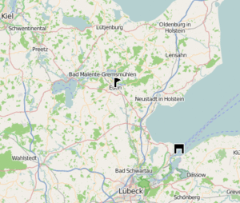
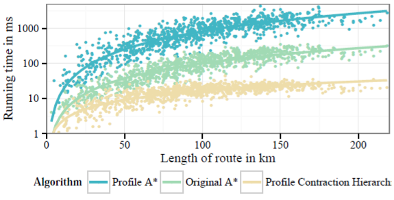
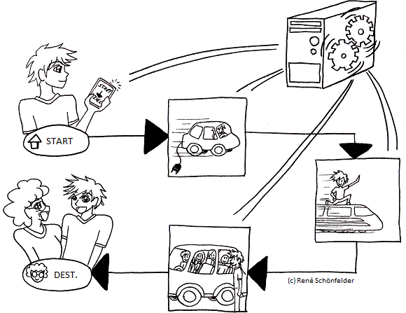

Here you can find a collection of the ideas we want to work on in the near future. If you want to participate in this year’s Google Summer of Code, you can choose one of the following ideas to apply for. 

For reference, this is [last year's ideas page](/news/2016-05-29-gosc2016/).

## First things first: Creating a routing server

The most essential part of GreenNav is the routing server. Amongst other things, it should be able to account for weather and height differences, and collaborate closely with the database project. Furthermore, it has to be fast, reliable, should be able to compute distributed, and must host a REST-API. The routing server needs to be able to implement different algorithms and enable optional profiling.

##### Further Information

*Prerequisites*: Java knowledge, routing algorithms and REST-APIs. Master student's are preferred

*Tools and Frameworks*: Java, Spring, OSM knowledge is a plus

*Estimation of difficulty*: High

*Potential mentor*: Sebastian, René, Max

## Persistence layer

Furthermore, we need a persistance layer to store the OSM data in an efficient way. The database has to store, for instance, weather, traffic, and height profiles and to perform intelligent data retrieval to optimize the IO for routing. Also, it should collaborate closely with the routing server project and needs to be easy to extend. This allows us to implement new routing algorithms easily.

##### Further Information

*Prerequisites*: Database knowledge, OSM/mapping experience, NoSQL/MapReduce

*Tools and Frameworks*: Java, Apache Spark

*Estimation of difficulty*: Average to high

*Potential mentor*: Max

## Mocking the CAN Bus

The CAN (Controller Area Network) bus is a protocol that microcontrollers in a vehicle use to communicate - without a host computer. By connecting to the bus, we can get access to a wide range of information about the vehicle, such as the current energy consumption. This is useful to learn about and predict the vehicle’s range. However, working on the actual hardware is a little out of scope, so we want to build a mock that can later be replaced by a physical CAN bus. 
The mock could be fed with a series of actual CAN bus traces. Augmented with the corresponding GPS coordinates, we can improve our model of energy consumption.

The highlighted components in this diagram are part of this idea. The GPS mock is quite simple and already exists.

##### Further Information

*Prerequisites*: Some experience in micro controller programming, further programming skills in Javascript/ReactJS, basic understanding of the CAN bus and how to read information from it.

*Tools and Frameworks*: ReactJS, some micro controller.

*Estimation of difficulty*: Average.

*Potential mentor*: Janis, Fabian

## A Solution for Range Anxiety

Because recharging an electric vehicle takes longer than refueling a combustion engined vehicle, the fear of most customers buying electric vehicles is the fear of running out of energy (range anxiety). Therefore, we want to solve this problem! 

One important step towards a solution is a precise computation and visualization of the vehicles range. This idea is about making visualization more succinct. What’s the use in just having a circle of a particular diameter? We want to show the driver a beautiful polygon.

This range polygon was created by segmenting the search space into 32 slices and taking the most distant vertex in each segment. Those are connected to form the polygon. This quite naive method is okay for starters, but there are various problems that we want to solve:

- Some places may be mistakenly marked as reachable, especially in mountainous areas.
- Some places may be mistakenly marked as non-reachable, because the slicing simplifies the polygon too much.
- The reachability decision is binary, but of of course some places can be reached with a lesser probability, for example those at the border of the polygon.
- Actually, two polygons are interesting: We want to see which places we can reach, and we also want to see a polygon describing the places that we can reach and also return home from, which is approximately half as big.

##### Further Information

*Prerequisites*: Knowledge about geographic coordinates and their transformations, programming skills in Javascript/ReactJS, basic understanding of the needs of electric vehicle drivers.

*Tools and Frameworks*: Javascript, ReactJS.

*Estimation of difficulty*: Easy to average.

*Potential mentor*: Fabian, Franz

## Prediction of energy consumption of electric vehicles

To predict the energy consumption of certain types of vehicles regarding the parameters of the taken route, we want to utilize machine learning methods. However, the main challenge here is to find suitable data for training and testing as well as deriving an architecture that is able to pecisely predict the energy consumption of different types of electric vehicles.

##### Further Information

*Prerequisites*: Experience in machine learning, knowledge in the framework of your choice

*Tools and Frameworks*: Machine learning framework of your choice (using Keras is suggested).

*Estimation of difficulty*: Average to difficult.

*Potential mentor*: Florian

## Charging Stations / Points of Interest

Unfortunately, charging stations are still quite sparse in many regions. Therefore, drivers of electric vehicles usually need to plan longer trips carefully. We want to provide the user with information about charging stations in the proximity of the chosen route. 

Furthermore, GreenNav is also about a sustainable and green lifestyle, so we want to add information about sustainable clothing shops, biological food markets, or any other location that our user group is interested in.

##### Further Information

*Prerequisites*: Basic knowledge in data processing to integrate the relevant information (ideally with OSM) into our database.

*Tools and Frameworks*: OSM, Javascript/ReactJS.

*Estimation of difficulty*: Average to difficult.

*Potential mentor*: Bruno, René

## Routing Benchmarks

Because we are also working on the routing algorithms, we want to measure and visualize our experiments. This is all about accurate measurement gathering and fancy visualizations.

In general, an algorithm may be seen as a black box. The input is transformed after some time to an output. We are interested, for instance, in running time and memory consumption. However, modern routing algorithms need to perform precomputations, such that queries can be answered more efficiently. This breaks the black box idea and we are therefore interested in a lot more aspects. Basically, two steps need to be measured: the precomputation and the query. Amongst other things, we are interested in:

- precomputation time
- precomputation memory/space consumption
- adaptation time on network changes
- query times
- query memory consumption
- number of visited vertices
- number of relaxed edges

Some of our algorithms are going to be implemented on the JVM, so one obvious choice would be to use JConsole, a built-in monitoring tool for the JVM.

Here are some visualizations we want to create:

##### Further Information

*Prerequisites*: Interest in scientific benchmarking, programming skills in Java/Scala, basic understanding of the JVM.

*Tools and Frameworks*: JConsole, JVM, ReactJS, some chart library (e.g. react-chartjs).

*Estimation of difficulty*: Average, can be tailored to fit the student's prior knowledge.

*Potential mentor*: Franz, Bruno

## Intermodality with GreenNav

This is about your creative ideas! There are many ways to make sustainable mobility more efficient, more comfortable, more reliable. Intermodality describes a route, in which you combine different kinds of transportation. Because electric vehicles are limited in range, a combination with rail traffic would be ideal. Let us hear about your suggestion for how this could be achieved.

##### Further Information

*Prerequisites*: Depends on your idea

*Tools and Frameworks*: It should fit our setting of Javascript/ReactJS on the frontend and maybe NodeJS or Java/Scala in the backend.

*Estimation of difficulty*: Depends, average to difficult.

*Potential mentor*: Bruno, Sebastian

## Traffic avoidance

One way to preserve energy is by avoiding traffic. Google does already give you the possibility to get notified when you have to leave - we want to go one step further and give more accurate energy consumption predictions by taking the traffic into account. This project does require a lot of collaboration with the database and the routing server student but can be solved independently. Data gathering and statistics are a huge part.

##### Further Information

*Prerequisites*: Statistics for time series prediction/data science, Java

*Tools and Frameworks*: Ideally Java or Scala, some statistics tools, general tinkering required!

*Estimation of difficulty*: Beginner to average

*Potential mentor*: Franz, Bruno

## Algorithmic visualization

One big reason for the GreenNav project to exist is that there are no dedicated easy-to-use routing algorithm development libraries. We aim to enable students and universities to make the field more interesting and approachable by providing the framework to implement new ideas fast and effortless. Especially the visualizations should yield insight into the inner workings. In this project, the student would implement one new algorithm and develop some visualizations for the front end.

##### Further Information

*Prerequisites*: Routing algorithms, visualization techniques

*Tools and Frameworks*: Java and JavaScript, D3.js is a plus
 
*Estimation of difficulty*: Beginner to average

*Potential mentor*: Bruno, Sebastian, Florian
